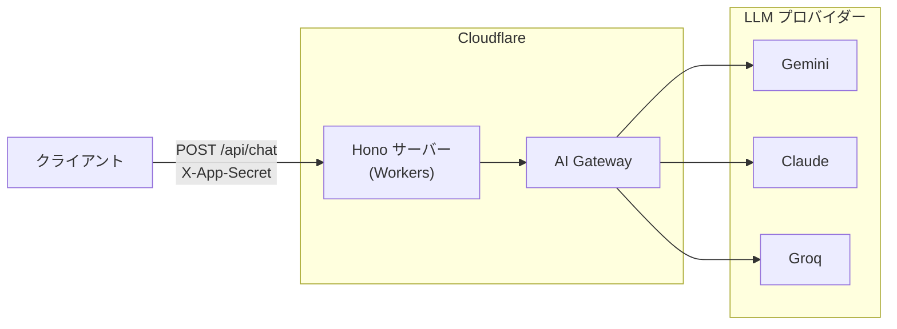

# ドキュメント目次

このディレクトリには、プロジェクトの**ストック情報**（永続的な知識）が整理されています。

---

## プロジェクトコンセプト

### 課題と目的

**課題**:

- LLM プロバイダーをクライアントから直接叩くと、API キーがブラウザに露出する
- プロバイダーごとに異なる API 仕様・認証方式をクライアント側で吸収するのは非効率

**目的**:

- API キーをサーバー側に秘匿したまま、クライアントに統一インターフェースを提供する
- プロバイダーの追加・切り替えをバックエンド側の変更だけで完結させる

### コンセプト

複数 LLM プロバイダーへの **統一ゲートウェイプロキシ**

- クライアントはプロバイダー名を指定するだけで、SSE ストリーミングによる LLM レスポンスを受け取れる
- Cloudflare AI Gateway を中継することで、レート制限・ログ・キャッシュ等の運用機能を一元管理する

---

## スコープ方針

### やること (In Scope)

- Gemini・Claude・Groq への統一 REST エンドポイント（`POST /api/chat`）
- SSE (Server-Sent Events) ストリーミングレスポンス
- `X-App-Secret` ヘッダーによるリクエスト認証
- `app_id` + `system_prompt` による階層的プロンプト構成
- 画像入力（base64 data URL・HTTPS URL）の各プロバイダー形式への変換

### やらないこと (Out of Scope)

- ユーザー管理・セッション管理
- レスポンスのキャッシュ・永続化（Cloudflare AI Gateway に委譲）
- プロバイダー間のフォールバック・ロードバランシング

---

## ドキュメント構成

```
docs/
└── README.md  # このファイル（プロジェクト概要・設計方針）
```

---

## アーキテクチャ



---

## 技術スタック

- **開発環境**: Node.js 24
  - パッケージ管理: npm
  - Linter & Formatter: ESLint + Prettier
  - Type checker: tsc
  - Test: Vitest
  - Task Runner: npm scripts
- **言語**: TypeScript v6
- **フレームワーク**: Hono v4
- **バリデーション**: Zod v4
- **デプロイ・ホスティング**: Cloudflare Workers (Wrangler v4)

---

## 関連リソース

- **[README.md](../README.md)**: プロジェクト説明
- **[CLAUDE.md](../CLAUDE.md)**: Claude Code への指示書
